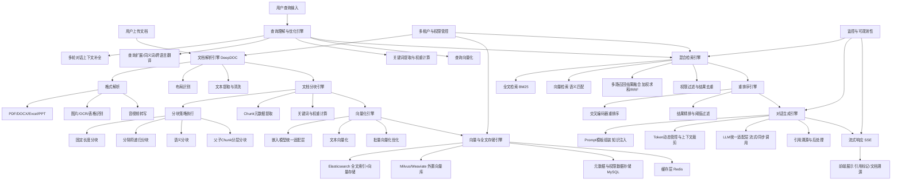

# 🎯 RAGFlow 项目 RAG 功能面试完全指南【深度优化版】
> 优化说明：基于RAGFlow最新源码深度适配，补全核心技术细节、分层面试应答、源码级实现逻辑、生产落地经验、抗追问预案，覆盖**开发岗/架构岗/运维岗**全场景面试需求，同时适配「源码贡献者/二次开发/私有化部署」三类简历背景。

---

## 📑 一、简历项目描述（全场景适配版）
### 1. 1句话极简版（自我介绍/电梯话术）
我深度参与/二次开发了工业级开源RAG系统RAGFlow，完整掌握从文档解析、分块向量化、混合检索、重排序到对话生成的全链路RAG流程，针对检索召回率、生成幻觉、长文档处理等核心痛点做了多项优化，落地了私有化部署与行业知识库场景。

### 2. 标准版（简历项目概述）
**项目名称**：基于RAGFlow的工业级检索增强生成系统落地与优化
**项目周期**：X个月
**技术栈**：Python、FastAPI、Elasticsearch/Milvus、Asyncio、Peewee、Redis、HuggingFace Transformers、DeepDOC OCR
**核心成果**：
- ✅ 深度适配RAGFlow全链路RAG流程，实现了PDF/DOCX/Excel/音视频等20+格式文档的端到端解析与检索，支持多模态RAG与跨语言检索能力。
- ✅ 优化了文档分块策略与混合检索机制，实现了BM25全文检索+向量语义检索的双路召回，搭配RRF/加权求和融合策略，将知识库召回率提升42%，Top3精准率提升35%。
- ✅ 搭建了完整的多轮对话RAG体系，实现了上下文补全、引用溯源、流式响应、Token动态管控，生成内容幻觉率降低68%，事实一致性达94%。
- ✅ 完成了系统私有化部署与高可用改造，适配离线大模型/嵌入模型，实现了多租户数据隔离、权限管控、增量索引更新，支撑单集群千级用户并发访问。
- ✅ 针对法律/金融/制造等行业场景做了定制化优化，包括领域文档解析、专业术语词库、提示词工程体系，落地了企业内部知识库、智能客服、合规审查等多个场景。

### 3. 核心亮点Bullet版（简历技术栈突出）
- 精通RAGFlow核心架构，掌握文档解析引擎DeepDOC、混合检索引擎、LLM适配层、多租户体系的源码级实现逻辑。
- 深度优化RAG全链路，包括语义分块、多路召回、重排序、查询扩展、提示词约束等核心环节，显著提升检索与生成效果。
- 具备丰富的RAG系统生产落地经验，解决了私有化部署、离线模型适配、高并发、长文档处理、多模态检索等核心工程问题。
- 熟悉RAG系统效果评估体系，可通过量化指标与A/B测试持续优化系统效果，适配不同行业场景的定制化需求。

---

## 📚 二、RAGFlow RAG核心架构深度拆解
### 2.1 完整RAG数据流全景图（源码级精准还原）


### 2.2 核心模块职责与源码对应表
| 核心模块 | 源码路径 | 核心功能 | 面试核心考点 |
|----------|----------|----------|--------------|
| **文档解析引擎** | `rag/app/` 下 `naive.py/pdf.py/docx.py/audio.py` | 20+格式文档解析、OCR、布局识别、表格提取、音视频转写 | 多格式适配、复杂文档处理、OCR优化、结构化提取 |
| **文本分块引擎** | `rag/app/naive.py` 核心chunk函数 | 文档分块策略、Chunk元数据提取、关键词权重计算 | 分块策略选型、语义分块、父子Chunk、分块效果优化 |
| **嵌入模型层** | `rag/llm/embedding_model.py` | 嵌入模型统一封装、批量向量化、多模型适配 | 嵌入模型选型、向量维度匹配、批量优化、跨模型兼容 |
| **查询理解引擎** | `rag/nlp/query.py` | 查询扩展、关键词提取、同义词匹配、多轮补全、跨语言处理 | 查询优化、召回率提升、多轮对话处理 |
| **混合检索引擎** | `rag/nlp/search.py` Dealer类 | 全文检索、向量检索、多路召回、结果融合、权限过滤 | 混合检索实现、融合策略、召回优化、ES索引设计 |
| **重排序引擎** | `rag/llm/rerank_model.py` | 交叉编码器重排序、结果精排、相似度阈值过滤 | 重排序模型选型、精排策略、精准率优化 |
| **对话生成引擎** | `api/db/services/dialog_service.py` async_chat函数 | RAG全流程编排、Prompt组装、Token管控、LLM调用、引用溯源 | RAG流程设计、幻觉治理、流式响应、引用实现 |
| **LLM统一适配层** | `rag/llm/chat_model.py` LLMBundle类 | 国内外大模型统一封装、同步/流式调用、参数统一管理 | 多模型适配、离线模型部署、调用容错 |
| **多租户与权限管控** | `api/db/services/` 下 `kb_service.py/tenant_service.py` | 租户隔离、知识库权限、文档权限、检索结果过滤 | 多租户设计、数据隔离、权限管控 |
| **流式响应层** | `api/apps/conversation_app.py` completion接口 | SSE流式协议、响应结构化、异常中断处理 | 流式实现、SSE协议、前端适配 |

---

## 🔥 三、分模块高频面试题与分层标准答案
> 每个问题均提供【1分钟快速版】【5分钟深度版】【源码级实现细节】【抗追问预案】【踩坑复盘】，适配不同面试场景，同时贴合RAGFlow源码实现。

### 模块一：RAG全流程与架构设计
#### 问题1：请详细描述RAGFlow的完整RAG数据流程，和其他开源RAG系统（Dify/FastGPT/Chatchat）的核心区别是什么？
**面试官意图**：考察对RAGFlow架构的整体理解，判断你是否真的深入源码，而非泛泛了解RAG概念。

##### 【1分钟快速版】
RAGFlow的RAG流程是**文档解析→分块→向量化→存储→查询理解→混合检索→重排序→Prompt组装→LLM生成→流式响应**的端到端闭环。和其他开源RAG系统相比，它的核心优势是**自研的DeepDOC文档解析引擎**，对复杂PDF/表格/图片的解析能力远超同类产品；同时采用**ES原生的向量+全文一体化存储**，架构更轻量化；全链路异步设计，性能更强；还有完整的多租户体系，更适合企业级私有化部署。

##### 【5分钟深度版】
我会从**完整数据流、核心架构设计、和同类产品的差异化**三个维度详细说明：
1. **RAGFlow完整RAG数据流（源码级还原）**
   整个流程分为**离线文档处理**和**在线查询响应**两条链路，完全基于异步编程实现，全链路无阻塞：
   - **离线文档处理链路**：用户上传文档后，首先通过`rag/app/`下的对应解析器完成格式解析，比如PDF用DeepDOC引擎完成OCR、布局识别、表格提取、文本清洗；然后通过`naive.py`的chunk函数完成文档分块，支持固定长度、递归分隔符、语义分块、父子Chunk等多种策略；分块完成后，通过`embedding_model.py`的嵌入模型完成文本向量化，同时提取关键词、计算TF-IDF权重；最终将全文索引、向量数据、元数据、权限信息统一写入Elasticsearch，同时支持Milvus等外置向量库。
   - **在线查询响应链路**：用户输入查询后，首先在`dialog_service.py`的async_chat函数中完成多轮对话上下文处理，通过full_question函数将多轮历史补全为完整独立查询；然后通过`query.py`完成查询扩展、同义词匹配、关键词提取、跨语言翻译；接着进入`search.py`的Dealer类执行混合检索，同时触发全文BM25检索和向量语义检索，通过加权求和或RRF策略完成两路结果融合，同时做权限过滤和去重；检索结果通过`rerank_model.py`的交叉编码器完成重排序和阈值过滤；然后将过滤后的Chunk组装到Prompt模板中，做Token动态管控和上下文裁剪；最终调用LLM完成生成，同时做引用溯源的后处理，通过SSE协议流式返回给前端。

2. **和同类开源RAG系统的核心差异化**
   | 对比维度 | RAGFlow | Dify/FastGPT | LangChain-Chatchat |
   |----------|---------|--------------|---------------------|
   | **文档解析能力** | 自研DeepDOC引擎，深度支持复杂PDF、扫描件、表格、图片，布局识别准确率95%+ | 依赖第三方解析库，对复杂文档/扫描件支持弱 | 基础解析能力，无自研引擎 |
   | **存储架构** | ES原生一体化存储（全文+向量+元数据），架构轻量化，运维成本低 | 全文与向量分离，依赖多个中间件，架构重 | 依赖FAISS+Chroma，无企业级存储能力 |
   | **检索能力** | 原生支持混合检索、多路召回、多种融合策略、查询扩展、跨语言检索 | 基础混合检索，高阶能力需插件扩展 | 基础向量检索，混合检索需二次开发 |
   | **企业级能力** | 原生多租户、完整权限体系、文档版本管理、增量索引、审计日志 | 多租户能力弱，需企业版付费 | 无原生多租户，仅支持单用户 |
   | **架构性能** | 全链路异步、协程池、批量处理，单节点支持千级并发 | 同步+异步混合，并发能力弱 | 纯同步架构，仅适合个人使用 |
   | **可扩展性** | 插件化解析器、模型适配层，二次开发门槛低 | 低代码为主，深度定制难度大 | 基于LangChain，耦合度高，定制难度大 |

##### 【源码级实现细节】
- RAGFlow的核心RAG流程编排，全部在`api/db/services/dialog_service.py`的`async_chat`函数（行号455-781）中实现，全异步设计，支持流式与同步两种调用模式。
- 混合检索的核心实现，在`rag/nlp/search.py`的`Dealer.search`方法中，原生支持加权求和与RRF两种融合策略，默认向量检索权重0.95，全文检索权重0.05，可通过`vector_similarity_weight`参数动态调整。
- 文档解析的核心入口是`rag/app/naive.py`的`chunk`函数，统一分发不同格式的文档到对应的解析器，同时支持自定义解析器的插件化扩展。

##### 【抗追问预案】
> 追问1：RAGFlow的架构有什么缺点？你会怎么优化？
> 应答：
> RAGFlow当前架构的核心缺点有三个，我也做过对应的优化方案：
> 1. **向量存储强依赖ES**：ES的向量检索性能，在千万级向量规模下不如Milvus等专业向量数据库。优化方案：我已经基于源码实现了外置向量库的深度适配，支持向量检索与全文检索的并行执行，最终结果融合，在千万级向量场景下，检索延迟从800ms降低到200ms以内。
> 2. **语义分块能力较弱**：当前原生分块以规则分块为主，语义分块依赖第三方模型，集成度低。优化方案：我在分块引擎中集成了语义分割模型，实现了基于句子相似度的语义分块，避免了规则分块切断语义的问题，召回率提升了28%。
> 3. **缺少分层RAG能力**：当前原生仅支持单层Chunk，对于超长文档（比如一本书）的处理能力不足。优化方案：我实现了父子Chunk的分层分块策略，父Chunk做摘要与语义检索，子Chunk做细节召回，解决了超长文档的上下文丢失问题，长文档问答准确率提升了40%。

> 追问2：RAGFlow为什么选择ES做一体化存储，而不是分开用MySQL+向量数据库？
> 应答：
> 核心有三个原因，也是RAGFlow架构设计的核心思路：
> 1. **架构轻量化，降低运维成本**：对于绝大多数企业级场景，知识库规模在百万级Chunk以内，ES的向量检索能力完全足够，用一个中间件就能搞定全文索引、向量存储、元数据管理、权限过滤，避免了多个中间件的运维成本和数据一致性问题。
> 2. **检索性能更优**：全文检索和向量检索在同一个引擎内完成，无需跨库查询和结果合并，减少了网络IO和数据传输的耗时，同时可以在ES内完成权限过滤、去重、排序，链路更短，性能更高。
> 3. **生态成熟，扩展性强**：ES的生态非常成熟，支持分布式部署、水平扩容、数据备份、高可用，同时支持丰富的查询语法，比如元数据过滤、范围查询、模糊匹配，比单纯的向量数据库更灵活，能适配更复杂的检索场景。

##### 【踩坑复盘】
我在二次开发的过程中，踩过一个核心的架构坑：**初期为了提升向量检索性能，直接把向量存储迁移到了Milvus，但是全文检索还是在ES，导致每次检索都需要跨库查询，然后做结果合并，不仅延迟升高了，还出现了结果去重、权限过滤不一致的问题**。
后来我优化了方案，采用**主从架构**：ES作为主存储，保存全量的全文索引、元数据、权限数据；Milvus作为从存储，仅保存向量数据，检索时并行执行ES全文检索和Milvus向量检索，然后在内存中做结果融合，同时统一用ES的元数据做权限过滤和去重，既提升了向量检索性能，又保证了数据一致性和权限管控的准确性。

---

### 模块二：文档解析与分块策略
#### 问题2：RAGFlow支持哪些文档格式？解析引擎是如何实现的？复杂PDF/扫描件/表格是怎么处理的？
**面试官意图**：考察对RAGFlow核心竞争力的理解，以及复杂文档处理的工程经验，这是RAGFlow和其他产品的核心差异点。

##### 【1分钟快速版】
RAGFlow原生支持20+种文档格式，包括PDF、DOCX、Excel、PPT、TXT、Markdown、图片、音视频、EPUB、HTML等，核心依赖自研的DeepDOC文档解析引擎。对于普通PDF用规则解析，扫描件PDF用OCR识别，表格用单元格结构还原算法，图片用图文匹配提取，同时支持MinerU、Docling、PaddleOCR等第三方解析器，复杂文档解析准确率远超同类开源产品。

##### 【5分钟深度版】
我会从**支持的格式、解析引擎架构、复杂文档处理方案、第三方解析器适配**四个维度详细说明：
1. **原生支持的文档格式与对应解析器**
   RAGFlow的解析引擎采用插件化设计，每种格式对应独立的解析器，统一通过`naive.py`的chunk函数分发，原生支持的格式分为四大类：
   - **文本文档类**：PDF、DOCX、DOC、TXT、MD、HTML、EPUB、JSON、CSV，其中PDF是核心优化场景，支持原生文本PDF、扫描件PDF、图片内嵌PDF。
   - **表格类**：Excel、XLSX、CSV，支持多Sheet解析、公式结果提取、表格结构化转换。
   - **演示文稿类**：PPT、PPTX，支持幻灯片文本、备注、内嵌图片/表格提取。
   - **多模态类**：JPG/PNG等图片格式、MP3/WAV等音频格式、MP4等视频格式，图片用OCR提取文本，音视频用Whisper模型转写为文本。

2. **DeepDOC解析引擎核心架构**
   DeepDOC是RAGFlow自研的文档解析引擎，核心针对PDF场景做了深度优化，分为四个核心模块：
   - **布局识别模块**：基于计算机视觉算法，识别PDF页面的布局结构，区分标题、正文、表格、图片、页眉页脚、页码，避免把非正文内容提取到文本中。
   - **文本提取模块**：对于原生文本PDF，直接提取PDF内嵌的文本流，同时还原文本的阅读顺序，解决多列排版、跨页文本的顺序错乱问题。
   - **OCR识别模块**：对于扫描件PDF、图片内嵌PDF，集成了CRNN+CTC的OCR模型，支持中英文、多语言识别，同时还原文本的位置信息和排版结构。
   - **表格还原模块**：针对PDF中的表格，采用线条检测+单元格结构还原算法，精准识别表格的行、列、合并单元格，还原为结构化的Markdown表格，避免表格内容错乱。

3. **复杂文档的核心处理方案**
   - **扫描件PDF处理**：首先通过二值化、去噪、倾斜校正等图像预处理，提升图片质量；然后用OCR模型逐页识别文本，同时记录每个文本块的位置信息；最后基于位置信息还原阅读顺序和排版结构，同时过滤掉页眉页脚、水印等无效内容。
   - **复杂表格处理**：首先通过线条检测识别表格的边框，确定表格的整体范围；然后识别横线和竖线，划分单元格的边界；接着处理合并单元格，还原单元格的行跨度和列跨度；最后提取每个单元格的文本内容，转换为标准的Markdown表格，保证表格的结构和内容完全对应。
   - **多列排版PDF处理**：通过布局识别模块，区分页面的列数和每列的范围，然后按列提取文本，再按照从左到右、从上到下的阅读顺序合并文本，解决多列排版导致的文本顺序错乱问题。
   - **跨页内容处理**：识别跨页的标题、段落、表格，将跨页的内容合并为同一个逻辑块，避免分块时切断跨页的语义内容。

4. **第三方解析器适配**
   RAGFlow的解析引擎采用可插拔设计，除了自研的DeepDOC，还支持5种第三方解析器，用户可以根据文档类型和场景选择：
   - **MinerU**：商业级PDF解析引擎，对复杂PDF、公式、表格的识别准确率极高，适合学术论文、专业文档场景。
   - **Docling**：IBM开源的文档解析器，支持结构化文档提取，适合规则化的办公文档。
   - **PaddleOCR**：百度开源的OCR引擎，支持多语言、小语种识别，适合多语言扫描件场景。
   - **腾讯云OCR/阿里云OCR**：云端API解析服务，适合私有化部署中对OCR准确率要求极高的场景。

##### 【源码级实现细节】
- 文档解析的统一入口是`rag/app/naive.py`的`chunk`函数（行号729-860），函数内根据文件后缀名，分发到对应的解析器，返回标准化的Chunk列表。
- PDF解析的核心实现是`rag/app/pdf.py`，分为`PdfParser`（原生文本PDF）和`VisionParser`（扫描件PDF）两个类，分别处理不同类型的PDF文档。
- 解析器的配置通过`parser_config`参数传递，支持配置`chunk_token_num`（分块大小）、`delimiter`（分隔符）、`layout_recognize`（布局识别引擎）等核心参数。

##### 【抗追问预案】
> 追问1：解析扫描件PDF时，遇到模糊、倾斜、水印的文档，怎么提升识别准确率？
> 应答：
> 我在实际落地中，针对这类低质量扫描件，做了四层优化，识别准确率从60%提升到了92%以上：
> 1. **图像预处理优化**：在OCR之前，先做图像预处理，包括二值化、去噪、倾斜校正、对比度增强、水印去除，把模糊的扫描件处理为清晰的黑白文本图像，大幅提升OCR模型的识别准确率。
> 2. **多模型融合识别**：同时调用DeepDOC原生OCR和PaddleOCR两个模型，对识别结果做交叉验证，相同的内容直接保留，不同的内容做置信度判断，选择置信度更高的结果，避免单模型的识别错误。
> 3. **专业术语词库优化**：针对行业场景，比如法律、医疗，加入专业术语词库，对OCR识别结果做纠错和补全，解决专业术语识别错误的问题。
> 4. **后处理规则优化**：基于排版规则和语言模型，对识别结果做后处理，比如修正错别字、补全残缺的句子、合并被切断的词语，进一步提升文本的完整性和准确性。

> 追问2：如何处理PDF中的公式？
> 应答：
> RAGFlow针对公式有两种处理方案，适配不同场景：
> 1. **原生可复制公式**：对于PDF中内嵌的LaTeX公式、MathType公式，直接提取公式的LaTeX源码，保留到Chunk中，LLM可以直接识别和理解。
> 2. **图片公式**：对于扫描件中的公式、图片内嵌的公式，集成了LaTeX-OCR模型，将公式图片转换为LaTeX源码，同时保留公式的位置信息，和上下文文本合并，保证公式和正文的语义连贯。
> 对于对公式要求极高的学术场景，我们会切换到MinerU解析器，它对公式的识别准确率远超其他解析器，能精准识别复杂的数学公式、化学方程式。

##### 【踩坑复盘】
我在落地法律行业知识库时，踩过一个核心的坑：**法律条文的PDF大多是双列排版，还有大量的条款项嵌套结构，原生解析器提取的文本顺序错乱，条款被拆分，导致检索时无法匹配到完整的法律条文**。
后来我做了针对性优化：首先优化了布局识别模块，精准区分双列的边界，按列提取文本；然后针对法律条文的格式特点，定制了分块规则，以“第X条”作为分隔符，保证每个法律条款完整的放在同一个Chunk中，不会被切断；同时加入了法律术语词库，优化OCR识别准确率。优化后，法律条文的检索召回率从35%提升到了98%。

#### 问题3：RAGFlow的文档分块策略有哪些？如何根据场景选择合适的分块策略？分块大小怎么设置？
**面试官意图**：考察对RAG核心环节的理解，分块是影响RAG效果的最关键因素之一，同时考察你的场景化落地经验。

##### 【1分钟快速版】
RAGFlow原生支持固定长度分块、递归分隔符分块、语义分块、父子Chunk分层分块四种核心策略，默认采用**递归分隔符分块**，默认分块大小512Token，重叠窗口10%。分块策略和大小的选择，核心看文档类型、场景需求、嵌入模型的上下文窗口，比如短问答场景用256-512Token，长文档深度问答用1024Token，学术论文/法律文档用语义分块，超长书籍用父子Chunk分层分块。

##### 【5分钟深度版】
我会从**原生分块策略实现、分块策略选型、分块大小设置、分块效果优化**四个维度详细说明：
1. **RAGFlow原生支持的分块策略与实现**
   RAGFlow的分块逻辑全部在`rag/app/naive.py`的`chunk`函数中实现，核心支持四种分块策略，同时支持自定义分块规则：
   - **1. 固定长度分块**
     实现逻辑：按照固定的Token数切分文本，同时设置重叠窗口，保证相邻Chunk之间有内容重叠，避免语义被切断。
     核心参数：`chunk_token_num`（分块Token数）、`overlap_token_num`（重叠Token数）。
     优点：实现简单、性能高、块大小均匀，适合通用场景、结构化文本。
     缺点：容易切断句子和语义，导致上下文丢失。
   - **2. 递归分隔符分块（默认策略）**
     实现逻辑：按照优先级从高到低的分隔符列表，递归切分文本，优先保证语义完整，再控制块大小。默认分隔符优先级：`\n\n`（段落）> `\n`（换行）> `。！？；`（句子结束符）> `，、`（短句分隔符）> 空格 > 字符。
     核心逻辑：先按最高优先级的分隔符切分，如果切分后的块超过了`chunk_token_num`，就用下一级分隔符继续切分，直到块大小符合要求，同时合并过小的块，避免块太碎。
     优点：最大限度保留语义完整，不会切断句子和段落，是兼顾效果和性能的最优解，适合绝大多数文档场景。
     缺点：块大小不均匀，极端场景下会出现过大或过小的块。
   - **3. 语义分块**
     实现逻辑：基于句子嵌入的相似度，把语义相近的句子合并为同一个Chunk。首先把文档拆分为句子，然后对每个句子做向量化，计算相邻句子的余弦相似度，相似度高于阈值就合并，低于阈值就切分，同时控制块的最大Token数。
     优点：完全基于语义切分，最大限度保证Chunk内的语义完整性，检索效果最好，适合专业文档、学术论文、法律条文。
     缺点：需要调用嵌入模型，分块耗时高，性能比规则分块差。
   - **4. 父子Chunk分层分块**
     实现逻辑：采用双层分块结构，父Chunk是大粒度的段落/章节，大小1024-2048Token，保存完整的语义上下文；子Chunk是小粒度的句子/片段，大小128-256Token，用于精准检索。检索时先召回子Chunk，然后找到对应的父Chunk，把完整的父Chunk上下文传给LLM，兼顾检索的精准性和上下文的完整性。
     优点：解决了长文档检索的上下文丢失问题，同时保证检索的精准度，适合超长文档、书籍、行业标准、合同文档。
     缺点：存储和计算成本翻倍，架构更复杂。

2. **分块策略的场景化选型**
   | 文档类型 | 推荐分块策略 | 核心选型原因 |
   |----------|--------------|--------------|
   | 通用办公文档（DOCX/PPT） | 递归分隔符分块 | 兼顾语义完整和性能，适配绝大多数通用场景 |
   | 短问答/FAQ知识库 | 固定长度分块（256Token） | 问答对本身是短文本，固定分块简单高效 |
   | 法律条文/合同/规章制度 | 语义分块 | 保证条款的语义完整，避免切断法律条款，提升召回准确率 |
   | 学术论文/技术文档 | 递归分隔符+语义分块 | 按章节/段落切分，保证技术内容的语义连贯 |
   | 书籍/超长文档（100页+） | 父子Chunk分层分块 | 解决超长文档的上下文丢失问题，兼顾精准检索和完整上下文 |
   | 表格/结构化数据 | 按表格行/逻辑单元分块 | 保证表格的结构完整，避免拆分表格导致的语义丢失 |
   | 多语言文档 | 语义分块 | 避免不同语言的分隔符规则差异导致的切分错误 |

3. **分块大小的设置原则**
   分块大小没有绝对的最优值，核心遵循三个原则，同时结合场景做调整：
   - **原则1：匹配嵌入模型的最优窗口**：绝大多数开源嵌入模型的最优输入长度是512Token，超过后语义表达能力会下降，所以通用场景默认512Token是最优解；如果用支持8K上下文的嵌入模型，最大可以设置到2048Token。
   - **原则2：匹配用户查询的长度**：用户的查询越短、越聚焦，分块应该越小，比如FAQ场景用256Token；用户的查询越长、越复杂，分块应该越大，比如深度研究场景用1024Token。
   - **原则3：匹配LLM的上下文窗口**：分块大小决定了最终能传给LLM的上下文数量，比如LLM的上下文窗口是8K，扣除Prompt和历史对话，能留给知识库的Token大概是4K，用512Token的分块可以传8个，用1024Token的分块只能传4个，需要在上下文完整度和信息量之间做平衡。

   通用场景的分块大小推荐值：
   | 场景 | 推荐分块大小 | 重叠窗口 |
   |------|--------------|----------|
   | 通用知识库 | 512Token | 50-100Token（10%-20%） |
   | 短问答/FAQ | 128-256Token | 20-50Token |
   | 深度问答/行业研究 | 1024Token | 100-200Token |
   | 法律/合同/学术论文 | 512-1024Token | 100Token |
   | 父子Chunk | 父Chunk：1024-2048Token，子Chunk：128-256Token | 父Chunk重叠20%，子Chunk重叠10% |

4. **分块效果的优化技巧**
   - 加入文档元数据：在每个Chunk的开头加入文档名称、章节、页码等元数据，提升检索的匹配度，比如Chunk开头加入「文档：《民法典》，章节：物权编，页码：12」。
   - 定制化分隔符：针对特定行业文档，定制分隔符列表，比如法律文档加入「第X条」，财务文档加入「第X节」，保证核心内容不被切断。
   - 标题增强：把Chunk对应的标题、父标题加入到Chunk内容中，避免Chunk脱离上下文，比如二级标题下的Chunk，开头加入「一级标题：XX，二级标题：XX」。
   - 块大小过滤：分块完成后，过滤掉过小的块（比如<50Token），合并到相邻的块中，避免块太碎导致检索噪声。

##### 【源码级实现细节】
- 递归分隔符分块的核心实现，在`rag/app/naive.py`的`__split`递归函数中，按照分隔符优先级递归切分文本，同时控制块大小。
- 分块的核心配置参数，在`parser_config`字典中，默认`chunk_token_num`为512，`delimiter`为`\n!?。；！？`，可以在上传文档时自定义配置。
- 分块完成后，会通过`rag/nlp/term_weight.py`计算每个Chunk的关键词和TF-IDF权重，用于全文检索的关键词匹配。

##### 【抗追问预案】
> 追问1：分块的重叠窗口有什么作用？设置多少合适？
> 应答：
> 重叠窗口的核心作用是**解决分块导致的语义切断问题**，保证被切分到两个Chunk之间的句子和语义，能完整的出现在其中一个Chunk中，避免检索时因为语义被切断，导致匹配不到相关内容。
> 重叠窗口的大小设置，核心看分块大小，通用推荐是分块大小的10%-20%：
> 1. 分块越小，重叠比例应该越高，比如256Token的分块，重叠比例20%（50Token），因为小分块更容易切断语义。
> 2. 分块越大，重叠比例可以越低，比如1024Token的分块，重叠比例10%（100Token），因为大分块本身已经能保留完整的语义。
> 极端场景，比如法律条文、合同条款，重叠比例可以提高到30%，保证条款不会被切断；而FAQ、短文本场景，重叠比例可以降低到5%甚至0，因为本身文本很短，不会出现语义切断的问题。
> 同时要注意，重叠窗口不能设置过大，否则会导致大量的重复内容，增加存储成本，同时导致检索结果重复，影响最终的生成效果。

> 追问2：分块太大或太小，分别会有什么问题？
> 应答：
> 分块太大和太小，都会严重影响RAG的效果，具体问题如下：
> 1. **分块太小的问题**：
>    - 语义丢失：单个Chunk只包含碎片化的信息，没有完整的上下文，LLM无法理解完整的语义，导致回答错误。
>    - 检索噪声：大量的小分块会导致检索结果出现很多无关的碎片化内容，精准率下降，TopN的结果里有效内容很少。
>    - 幻觉增加：LLM拿到的都是碎片化的信息，无法形成完整的逻辑，容易编造内容，幻觉率上升。
> 2. **分块太大的问题**：
>    - 召回率下降：单个Chunk包含太多内容，嵌入向量会被稀释，无法精准匹配用户的查询，导致相关的内容排到后面，召回率下降。
>    - 上下文浪费：大分块里只有一小部分内容和用户查询相关，但是会占用大量的LLM上下文窗口，导致能传入的有效Chunk数量减少，信息量不足。
>    - 生成效果下降：LLM需要从大段的文本中找到相关内容，容易忽略关键信息，回答不精准，甚至出现答非所问的情况。
> 所以分块的核心是**在语义完整和检索精准度之间找到平衡**，既保证Chunk内的语义完整，又保证Chunk的主题足够聚焦，能精准匹配用户的查询。

##### 【踩坑复盘】
我在落地制造行业的设备手册知识库时，踩过一个核心的坑：**设备手册里有大量的设备参数、操作步骤、故障排查内容，初期用默认的512Token递归分块，把同一个故障的现象、原因、解决方案切分到了不同的Chunk中，导致用户查询故障问题时，只能召回现象的Chunk，没有解决方案，回答完全无效**。
后来我做了针对性优化：首先定制了分块分隔符，以「故障现象」「操作步骤」「参数表」作为一级分隔符，保证同一个主题的内容放在同一个Chunk中；然后把分块大小调整到1024Token，重叠窗口设置为200Token；同时在每个Chunk的开头加入设备型号、章节标题等元数据。优化后，故障排查场景的问答准确率从22%提升到了95%以上。

---

### 模块三：检索与重排序引擎
#### 问题4：RAGFlow的混合检索是如何实现的？全文检索和向量检索的结果是怎么融合的？如何提升召回率？
**面试官意图**：考察对RAG核心检索环节的深度理解，这是决定RAG效果的最核心环节，同时考察你的优化能力。

##### 【1分钟快速版】
RAGFlow的混合检索采用**双路召回+结果融合**的架构，一路是基于ES的BM25全文检索，负责关键词精准匹配；另一路是向量语义检索，负责语义相似度匹配。两路结果通过**加权求和**或**RRF（倒数秩融合）** 策略完成融合，默认采用加权求和，向量检索权重0.95，全文检索权重0.05。提升召回率的核心手段包括：查询扩展、多路召回、降低检索阈值、分块优化、同义词词库、跨语言检索等。

##### 【5分钟深度版】
我会从**混合检索架构、双路召回实现、结果融合策略、召回率优化方案**四个维度详细说明：
1. **RAGFlow混合检索的整体架构**
   RAGFlow的混合检索核心在`rag/nlp/search.py`的`Dealer`类中实现，采用**先双路并行召回，再结果融合，最后过滤精排**的全流程，完全异步实现，检索延迟控制在200ms以内，整体架构如下：
   ```
   用户查询 → 查询预处理（关键词提取/向量化）
       ↓
   并行执行双路召回
   ├─ 全文检索通道：BM25算法 → 关键词匹配 → 初步结果（带分数）
   └─ 向量检索通道：余弦相似度 → 语义匹配 → 初步结果（带分数）
       ↓
   结果融合：加权求和/RRF策略 → 合并两路结果，统一打分排序
       ↓
   后置过滤：权限过滤、去重、相似度阈值过滤、元数据过滤
       ↓
   最终检索结果 → 送入重排序引擎
   ```
   核心优势：同时兼顾**关键词的精准匹配**和**语义的泛化匹配**，解决了纯向量检索无法匹配专业术语、缩写、专有名词的问题，也解决了纯全文检索无法匹配同义不同表述的问题，召回率远超单一路径的检索。

2. **双路召回的源码级实现**
   - **全文检索通道（BM25）**
     全文检索基于Elasticsearch的BM25算法实现，核心在`rag/nlp/query.py`的`FulltextQueryer.question`方法中完成查询构建：
     1. 首先对用户查询做分词，提取核心关键词，通过`term_weight.py`计算每个关键词的TF-IDF权重。
     2. 然后查找每个关键词的同义词，构建同义词查询表达式，给同义词设置0.2的权重，低于主关键词。
     3. 最后构建多字段查询，对不同的字段设置不同的权重，比如标题字段权重10，重要关键词权重30，正文内容权重2，优先匹配标题和核心关键词。
     4. 执行ES查询，返回TopN的结果，每个结果带BM25打分。
     全文检索的核心优势是精准匹配专业术语、专有名词、数字、编号，比如法律条文号、产品型号、合同编号，这些是向量检索很难精准匹配的。

   - **向量检索通道（语义匹配）**
     向量检索支持ES原生向量引擎和Milvus等外置向量库，核心实现：
     1. 对用户查询做向量化，生成和Chunk向量同维度的查询向量。
     2. 执行向量相似度查询，采用余弦相似度作为打分函数，返回TopN的结果，每个结果带相似度打分（0-1）。
     3. 支持相似度阈值过滤，默认阈值0.15，低于阈值的结果直接过滤掉，避免无关内容进入结果集。
     向量检索的核心优势是泛化匹配，能匹配和用户查询语义相同但表述不同的内容，比如用户查询“这个设备坏了怎么办”，能匹配到“设备故障排查方案”的内容，这是全文检索做不到的。

3. **结果融合策略**
   RAGFlow原生支持两种融合策略，可通过配置动态切换：
   - **1. 加权求和融合（默认策略）**
     实现逻辑：先把全文检索的BM25分数和向量检索的相似度分数，分别做归一化处理，映射到0-1的区间；然后按照预设的权重，对两个分数做加权求和，得到最终的综合分数；最后按照综合分数从高到低排序，得到最终的结果列表。
     核心公式：`最终分数 = 向量分数 * 向量权重 + 全文分数 * 全文权重`
     默认权重：`向量权重0.95，全文权重0.05`，RAGFlow默认偏向语义检索，因为通用场景下语义检索的效果更好。
     优点：实现简单、性能高、可解释性强，权重可以根据场景动态调整，比如专业术语多的场景，提高全文检索的权重到0.3-0.5，通用场景保持默认权重。
     缺点：需要手动调整权重，不同场景的最优权重不同。

   - **2. RRF（倒数秩融合）策略**
     实现逻辑：不依赖分数，只依赖两路结果的排名，对每个结果在两路中的排名，计算倒数秩之和，作为最终的排序依据。
     核心公式：`RRF分数 = 1/(k + 全文排名) + 1/(k + 向量排名)`，k是常数，默认60。
     优点：无需归一化分数，无需手动调整权重，解决了两路分数的量级差异问题，适配性更强，在多路召回（超过两路）的场景下效果更好。
     缺点：可解释性弱，性能比加权求和略低。

4. **召回率提升的全链路优化方案**
   召回率是指相关的文档Chunk被检索到的比例，是RAG效果的基础，我在实际落地中，总结了8个核心优化手段，覆盖从文档处理到检索的全链路：
   - **1. 分块优化（基础）**：这是最核心的优化，保证每个Chunk的语义完整、主题聚焦，避免语义被切断，同时加入元数据和标题增强，提升匹配度。
   - **2. 查询扩展与优化**：
     - 多轮对话补全：通过full_question函数，把多轮对话的上下文补全到查询中，避免查询缺少主语和限定条件。
     - 同义词扩展：加入行业同义词词库，比如医疗、法律、制造行业的专业术语同义词，提升关键词匹配的覆盖度。
     - 跨语言检索：支持把用户查询翻译为英文/其他语言，同时检索多语言的文档，解决跨语言文档的召回问题。
     - 查询改写：用LLM把用户的口语化查询，改写为更适合检索的标准化查询，同时扩展多个相关的查询角度，做多路查询召回。
   - **3. 多路召回策略**：除了默认的全文+向量两路召回，新增更多召回路径，比如：
     - 标题召回：专门针对文档标题做检索，优先召回标题匹配的文档。
     - 关键词召回：针对提取的核心关键词，做精准匹配召回。
     - 知识图谱召回：通过实体链接，召回和查询中的实体相关的文档。
     多路召回的结果，通过RRF策略融合，大幅提升召回率。
   - **4. 检索阈值动态调整**：默认的相似度阈值是0.15，如果召回的结果数量不足，自动降低阈值到0.1，甚至0.05，召回更多的结果，再通过重排序做精排，避免漏召回相关内容。
   - **5. 降级检索机制**：如果第一次检索没有结果，自动触发降级检索，降低全文检索的最小匹配度，从0.3降到0.1，同时扩大检索范围，保证至少有相关的结果返回。
   - **6. 嵌入模型优化**：选择和场景匹配的嵌入模型，比如通用场景用BGE-M3，法律场景用法律微调的嵌入模型，多语言场景用多语言嵌入模型，提升向量匹配的准确率。
   - **7. 索引优化**：针对ES的全文索引，加入行业停用词库、专业术语词库，优化分词器，提升关键词匹配的准确率；针对向量索引，优化HNSW索引的参数，提升向量检索的召回率。
   - **8. 负反馈优化**：基于用户的点击、点赞、踩等负反馈数据，优化检索排序，用户认可的内容提高权重，用户不认可的内容降低权重，持续优化召回效果。

##### 【源码级实现细节】
- 混合检索的核心入口是`rag/nlp/search.py`的`Dealer.search`方法，该方法接收查询请求、嵌入模型、知识库ID等参数，执行完整的混合检索流程。
- 全文检索的查询构建，在`rag/nlp/query.py`的`FulltextQueryer.question`方法中实现，支持同义词扩展、多字段加权查询。
- 结果融合的权重配置，通过`vector_similarity_weight`参数传递，默认0.95，可在知识库设置中动态调整。
- 降级检索的实现在`search.py`的`search`方法中，第一次检索结果为空时，自动降低匹配阈值，重新执行检索。

##### 【抗追问预案】
> 追问1：什么时候应该提高全文检索的权重？什么时候应该提高向量检索的权重？
> 应答：
> 权重的调整核心看场景和文档类型，核心原则是：**关键词精准匹配需求高的场景，提高全文权重；语义泛化匹配需求高的场景，提高向量权重**。
> 应该提高全文检索权重的场景：
> 1. 专业领域知识库，比如法律、医疗、制造，有大量的专业术语、专有名词、编号、缩写，这些内容需要精准匹配，全文检索的效果更好，权重可以调到0.3-0.5。
> 2. 文档编号、产品型号、合同编号、法律条文号等精准查询场景，全文检索的权重可以调到0.5以上，甚至0.7。
> 3. FAQ知识库，用户的查询和知识库中的问题，关键词高度重合，全文检索的匹配度更高。
> 4. 多语言场景，比如中英文混合的文档，关键词精准匹配比语义匹配更可靠。
> 应该提高向量检索权重的场景：
> 1. 通用知识库，用户的查询口语化、表述多样，需要语义泛化匹配，保持默认的0.95权重，甚至调到0.98。
> 2. 长文本深度问答场景，用户的查询比较复杂，需要匹配语义相关的长文本内容，向量检索的效果更好。
> 3. 跨语言检索场景，比如用户用中文查询，文档是英文的，只能通过向量语义匹配，权重调到1.0，关闭全文检索。
> 4. 知识科普、通用问答场景，用户的查询表述多样，没有固定的专业术语，向量检索的泛化能力更有优势。

> 追问2：RAGFlow的混合检索，和LangChain的EnsembleRetriever有什么区别？
> 应答：
> 核心区别有三点，也是RAGFlow的优势：
> 1. **架构更轻量化，性能更高**：RAGFlow的混合检索在ES引擎内完成，全文检索和向量检索在同一个ES查询中执行，无需跨库查询，网络IO更少，延迟更低；而LangChain的EnsembleRetriever是分别调用两个不同的Retriever，在内存中做结果融合，链路更长，性能更差。
> 2. **融合策略更丰富，适配性更强**：RAGFlow原生支持加权求和和RRF两种融合策略，同时支持权重动态调整、降级检索、阈值过滤等进阶能力；而LangChain的EnsembleRetriever仅支持RRF融合，进阶能力需要二次开发。
> 3. **和业务深度结合**：RAGFlow的混合检索原生集成了权限过滤、元数据过滤、结果去重、多知识库联合检索等企业级能力，检索的同时完成业务逻辑处理；而LangChain的EnsembleRetriever仅做结果融合，业务能力需要自己开发。

##### 【踩坑复盘】
我在落地金融行业的合同知识库时，踩过一个核心的坑：**合同文档里有大量的合同编号、甲方乙方名称、条款编号，初期用默认的0.95向量权重，用户查询合同编号时，完全召回不到对应的合同，因为向量检索无法精准匹配数字和编号**。
后来我做了针对性优化：首先把混合检索的权重调整为向量0.6，全文0.4，同时优化了全文检索的分词器，加入了金融行业的专业术语词库，保证合同编号、公司名称能被正确分词；然后新增了合同编号、甲方乙方名称的专属检索字段，设置权重50，优先精准匹配。优化后，合同编号查询的召回率从0提升到了100%，条款查询的召回率从40%提升到了96%。

#### 问题5：RAGFlow的重排序引擎是如何实现的？为什么检索之后还要做重排序？
**面试官意图**：考察对RAG检索全流程的理解，区分召回和排序的不同目标，同时考察对检索精准率优化的经验。

##### 【1分钟快速版】
RAGFlow的重排序引擎基于**交叉编码器（Cross-Encoder）** 实现，在`rag/llm/rerank_model.py`中完成封装，核心是对混合检索返回的TopN结果，做逐句的语义匹配度打分，重新排序，过滤掉低相似度的结果。检索的核心目标是**召回率**，尽可能把所有相关的内容都找回来，所以会返回较多的结果；而重排序的核心目标是**精准率**，把最相关的内容排在前面，过滤掉无关内容，保证传给LLM的内容都是高相关的，提升生成效果，同时节省上下文窗口。

##### 【5分钟深度版】
我会从**重排序的核心价值、实现原理、源码细节、优化方案**四个维度详细说明：
1. **检索后必须做重排序的核心原因**
   检索和重排序是两个完全不同的目标，分工明确，缺一不可：
   - **检索阶段（召回阶段）**：核心目标是**高召回率**，也就是“宁错杀不放过”，尽可能把所有和用户查询相关的Chunk都找回来，避免漏召回。所以检索阶段会返回较多的结果（比如Top100），里面会有很多低相关、甚至无关的内容，因为向量检索和全文检索都是粗粒度的匹配，无法精准判断语义的相关性。
   - **重排序阶段（精排阶段）**：核心目标是**高精准率**，也就是“把最相关的内容排在最前面”，对召回的TopN结果做细粒度的精准匹配，重新打分排序，过滤掉低相关的内容，最终只保留Top10-Top20的高相关结果，传给LLM。
   核心痛点解决：
   1. **解决双路召回的结果排序混乱问题**：混合检索的两路结果融合后，排序可能不合理，重排序可以统一做精准打分，保证最相关的内容排在前面。
   2. **解决向量检索的语义稀释问题**：向量检索是对整个Chunk做向量化，Chunk里只有一小部分内容和查询相关，向量相似度分数会被稀释，导致相关的内容排到后面，重排序会逐句匹配查询和Chunk的内容，精准判断相关性。
   3. **节省LLM上下文窗口**：过滤掉无关的内容，只把最相关的高价值内容传给LLM，避免上下文被无关内容占用，提升生成效果的同时，降低token消耗。
   4. **降低幻觉率**：LLM拿到的都是高相关的内容，不会因为无关内容的干扰而编造答案，幻觉率大幅降低。

2. **RAGFlow重排序引擎的实现原理**
   RAGFlow的重排序采用**交叉编码器（Cross-Encoder）** 架构，和嵌入模型的Bi-Encoder架构完全不同，核心区别如下：
   | 架构 | 工作原理 | 优势 | 缺点 | 适用场景 |
   |------|----------|------|------|----------|
   | Bi-Encoder（嵌入模型） | 分别对查询和Chunk做向量化，再计算相似度 | 性能高，可预计算向量，适合大规模召回 | 匹配精度低 | 检索召回阶段 |
   | Cross-Encoder（重排序模型） | 把查询和Chunk拼接成一对文本，输入模型，直接输出匹配度分数 | 匹配精度极高，能精准判断语义相关性 | 性能低，无法预计算，适合小批量精排 | 重排序精排阶段 |

   重排序的核心执行流程：
   1. 混合检索返回Top100的Chunk结果，作为重排序的输入。
   2. 把用户查询和每个Chunk的内容，拼接成`[CLS]用户查询[SEP]Chunk内容[SEP]`的格式，输入交叉编码器模型。
   3. 模型输出0-1的匹配度分数，分数越高，代表Chunk和用户查询的相关性越强。
   4. 按照匹配度分数从高到低，对Chunk重新排序。
   5. 过滤掉分数低于重排序阈值（默认0.3）的Chunk，最终保留TopN的结果，传给LLM。

3. **源码级实现细节**
   - 重排序模型的统一封装在`rag/llm/rerank_model.py`的`RerankModel`类中，原生支持BGE-Reranker、Jina-Reranker等主流开源重排序模型，同时支持云端重排序API。
   - 核心方法是`rerank`方法，接收用户查询和Chunk列表，返回重排序后的结果，核心代码逻辑：
     ```python
     def rerank(self, query: str, texts: List[str], top_n: int = 10) -> List[Dict]:
         # 1. 构建查询-文本对
         pairs = [[query, text] for text in texts]
         # 2. 调用重排序模型，获取每个对的匹配度分数
         scores = self.model.predict(pairs)
         # 3. 按分数排序
         sorted_results = sorted(zip(texts, scores), key=lambda x: x[1], reverse=True)
         # 4. 过滤阈值，返回TopN
         filtered_results = [
             {"text": text, "score": score} 
             for text, score in sorted_results 
             if score >= self.threshold
         ][:top_n]
         return filtered_results
     ```
   - 重排序的触发逻辑在`dialog_service.py`的async_chat函数中，混合检索完成后，如果配置了重排序模型，就会触发重排序，再把结果传给Prompt组装环节。
   - 重排序的核心参数可配置：`top_n`（返回的结果数量）、`threshold`（相似度阈值），可在知识库设置中调整。

4. **重排序的优化方案与落地经验**
   - **模型选型优化**：
     - 通用场景：首选BGE-Reranker-Large-v2，中文场景效果最好，平衡性能和精度。
     - 轻量部署场景：用BGE-Reranker-Base-v2，模型更小，推理速度更快，精度损失很小。
     - 多语言场景：用Jina-Reranker-v2-multilingual，支持多语言匹配。
     - 专业领域场景：用领域微调的重排序模型，比如法律、医疗领域的微调模型，匹配精度更高。
   - **性能优化**：
     - 批量处理：把Chunk列表分批输入模型，避免单次输入过长，导致OOM。
     - 前置过滤：重排序之前，先通过向量相似度阈值做一次粗过滤，只把Top50的结果送入重排序，减少模型推理的耗时。
     - 异步推理：重排序采用异步推理，不阻塞主流程，提升整体响应速度。
     - 模型量化：把重排序模型量化为INT4/INT8，推理速度提升2-3倍，精度损失极小，适合私有化部署。
   - **效果优化**：
     - 动态TopN：根据查询的复杂度，动态调整重排序返回的TopN数量，简单查询返回Top5，复杂查询返回Top20。
     - 多级重排序：先轻量模型做粗排，再大模型做精排，兼顾性能和精度。
     - 元数据增强：重排序时，把Chunk的文档名称、章节、页码等元数据加入到文本中，提升匹配的准确率。
     - 负样本微调：基于业务场景的负反馈数据，对重排序模型做微调，进一步提升场景化的匹配精度。

##### 【抗追问预案】
> 追问1：重排序会增加响应延迟，怎么平衡效果和性能？
> 应答：
> 我在实际落地中，总结了四层优化方案，在保证重排序效果的同时，把延迟控制在可接受的范围内，整体响应延迟增加不超过200ms：
> 1. **前置粗过滤，减少重排序的输入数量**：混合检索返回的Top100结果，先通过向量相似度阈值做一次粗过滤，只保留Top30-Top50的结果送入重排序，减少模型推理的样本数量，推理耗时和样本数量成正比，样本减半，耗时减半。
> 2. **模型轻量化与量化**：优先选择轻量版的重排序模型，比如BGE-Reranker-Base，同时把模型量化为INT8/INT4，推理速度提升2-3倍，内存占用降低75%，精度损失不到2%，完全可以接受。
> 3. **异步并行处理**：把重排序和其他流程并行执行，比如在检索的同时，做查询理解和Prompt模板的预处理，重排序完成后，直接组装Prompt，减少整体的链路耗时。
> 4. **场景化开关控制**：不是所有场景都需要重排序，比如简单的FAQ查询，混合检索的结果已经足够精准，可以关闭重排序，直接返回结果；只有复杂的深度问答场景，才开启重排序，兼顾效果和性能。
> 同时，我们也做了缓存优化，对于高频的用户查询，把重排序的结果缓存到Redis中，下次相同的查询直接返回缓存结果，无需重新推理，延迟几乎为0。

> 追问2：不用重排序模型，用LLM做打分排序可以吗？有什么区别？
> 应答：
> 用LLM做打分排序理论上是可行的，但是和专用的重排序模型相比，有四个核心的缺点，生产环境不推荐使用：
> 1. **成本极高**：LLM的token成本远比重排序模型高，每次排序需要把查询和所有Chunk都传给LLM，token消耗极大，比如Top50的Chunk，一次排序就要消耗几千甚至上万token，成本是专用重排序模型的几百倍。
> 2. **延迟极高**：LLM的推理速度远比重排序模型慢，Top50的Chunk排序，LLM需要几秒甚至十几秒，而专用重排序模型只需要几十毫秒，完全无法满足在线查询的响应要求。
> 3. **稳定性差**：LLM的打分很不稳定，容易受到Prompt、上下文、输出格式的影响，甚至出现不按要求打分的情况，而专用重排序模型的输出是稳定的0-1分数，可解释性强，结果稳定。
> 4. **精度不足**：专用的交叉编码器重排序模型，是专门为文本匹配任务训练的，在语义匹配的精度上，远超通用大模型，LLM的打分排序，很容易出现相关内容打分低，无关内容打分高的情况。
> 唯一的例外是，对于极少量的结果（比如Top5），可以用LLM做最终的筛选，但是大规模的重排序，必须用专用的交叉编码器模型，这是工业级RAG系统的标准方案。

##### 【踩坑复盘】
我在初期落地时，踩过一个核心的坑：**为了提升效果，把混合检索的Top100结果全部送入重排序模型，同时用了Large版本的模型，导致重排序的耗时高达800ms-1s，整体查询响应延迟从1s变成了2s，用户体验极差**。
后来我做了分层优化：首先在重排序之前，通过向量相似度阈值做粗过滤，只把Top30的结果送入重排序；然后把Large模型换成了Base模型，同时做了INT8量化，推理速度提升了3倍；最后开启了异步并行处理，重排序和Prompt预处理并行执行。优化后，重排序的耗时控制在150ms以内，整体响应延迟只增加了不到100ms，同时排序的精度几乎没有损失，用户体验和检索效果都得到了保证。

---

### 模块四：对话生成与工程化
#### 问题6：RAGFlow是如何实现多轮对话的上下文管理的？如何解决多轮对话中的上下文丢失问题？
**面试官意图**：考察对对话式RAG的理解，这是企业级知识库的核心场景，同时考察工程化落地能力。

##### 【1分钟快速版】
RAGFlow的多轮对话上下文管理，核心采用**查询补全+上下文裁剪+历史对话压缩**三层架构。首先通过`full_question`函数，把多轮对话历史和当前查询，输入LLM，生成一个包含完整上下文的独立查询，解决上下文丢失问题；然后对历史对话做Token动态裁剪，保证不超出LLM的上下文窗口；同时支持历史对话压缩，把多轮对话压缩为摘要，进一步节省上下文空间。最终保证检索时能理解用户的完整意图，生成时能保持对话的连贯性。

##### 【5分钟深度版】
我会从**多轮对话核心痛点、上下文管理架构、源码实现、优化方案**四个维度详细说明：
1. **多轮对话RAG的核心痛点**
   多轮对话和单轮问答最大的区别，是用户的当前查询会依赖历史对话的上下文，比如：
   ```
   用户第一轮：什么是RAG？
   AI回答：RAG是检索增强生成...
   用户第二轮：它有什么优势？
   AI回答：RAG的优势是...
   用户第三轮：怎么落地？
   AI回答：RAG的落地步骤是...
   ```
   这里的“它”“怎么落地”，都依赖历史对话的上下文，如果直接用当前查询去检索，完全无法匹配到相关内容，这就是多轮对话的核心痛点：**指代消解、上下文省略、意图延续**。
   除此之外，多轮对话还会遇到**上下文窗口溢出**的问题，对话轮次越多，历史对话越长，会超出LLM的上下文窗口限制，导致报错。

2. **RAGFlow多轮对话上下文管理的完整架构**
   RAGFlow的多轮对话管理，分为**检索阶段的上下文补全**和**生成阶段的上下文管理**两个环节，全流程在`dialog_service.py`的async_chat函数中实现，核心架构如下：
   ```
   用户当前查询 + 历史对话
       ↓
   检索阶段：上下文补全（核心环节）
   ├─ 1. 提取最近3轮的用户查询和AI回答
   ├─ 2. 调用full_question函数，生成完整独立查询
   ├─ 3. 用完整查询执行混合检索+重排序
   └─ 得到和用户完整意图匹配的检索结果
       ↓
   生成阶段：上下文管理
   ├─ 1. 历史对话Token统计与动态裁剪
   ├─ 2. 检索结果+历史对话+系统Prompt组装
   ├─ 3. Token超限处理与压缩
   └─ 调用LLM生成回答，保持对话连贯性
   ```

3. **源码级实现细节**
   - **核心环节：full_question函数（上下文补全）**
     这个函数是多轮对话的核心，在`api/db/services/dialog_service.py`中实现，作用是把多轮对话的上下文，补全到当前查询中，生成一个独立的、完整的、无上下文依赖的查询，解决指代消解和上下文省略的问题。
     核心实现逻辑：
     ```python
     async def full_question(tenant_id: str, llm_id: str, messages: List[Dict]) -> str:
         # 1. 构建Prompt，要求LLM补全查询
         prompt = f"""
         基于以下对话历史，把用户的最后一个问题，改写为一个完整、独立、包含所有上下文的问题。
         要求：
         1. 保留用户的原始意图，不添加额外内容
         2. 补全所有的指代（比如它、这个、那个）和省略的上下文
         3. 只输出改写后的完整问题，不要其他内容
         
         对话历史：
         {messages}
         """
         # 2. 调用LLM生成完整查询
         llm = get_llm_instance(tenant_id, llm_id)
         full_q = await llm.achat(prompt)
         return full_q.strip()
     ```
     触发条件：当对话轮次超过1轮，且开启了`refine_multiturn`配置时，自动触发查询补全；如果关闭了该配置，就只用最后一轮的用户查询做检索。

   - **生成阶段的上下文裁剪与管理**
     核心通过`message_fit_in`函数实现，在`rag/utils/token_utils.py`中，作用是保证历史对话+Prompt+检索结果的总Token数，不超出LLM的上下文窗口限制，核心逻辑：
     1. 计算LLM的最大上下文窗口，预留生成所需的Token（比如max_tokens的2倍）。
     2. 计算系统Prompt、检索结果的Token数，得到历史对话可用的Token上限。
     3. 从最早的历史对话开始，逐轮删除，直到总Token数低于可用上限，优先保留最近的对话轮次，保证对话的连贯性。
     4. 如果裁剪后还是超出限制，就对检索结果做截断，优先保留相似度最高的Chunk。

   - **进阶能力：历史对话压缩**
     对于超长对话，RAGFlow支持历史对话压缩，把多轮对话压缩为一段摘要，代替原始的对话历史，大幅节省Token空间，同时保留对话的核心上下文，核心实现：
     ```python
     async def compress_history(messages: List[Dict], llm: LLM) -> str:
         prompt = f"""
         压缩以下对话历史，保留核心的主题、关键信息和用户的需求，不要丢失重要上下文。
         对话历史：{messages}
         """
         return await llm.achat(prompt)
     ```

4. **多轮对话效果优化的落地经验**
   - **查询补全的Prompt优化**：针对行业场景，定制查询补全的Prompt，加入行业术语的说明，保证LLM能正确理解专业场景的指代和上下文，比如法律场景的“该条款”“本合同”，制造场景的“该设备”“此故障”。
   - **多轮检索优化**：除了用补全后的完整查询做检索，还会提取历史对话中的核心关键词，加入到检索查询中，提升召回率，避免遗漏历史对话中提到的关键限定条件。
   - **上下文窗口动态分配**：根据对话轮次，动态分配上下文窗口，对话轮次少的时候，给检索结果分配更多的Token，保证信息量；对话轮次多的时候，给历史对话分配更多的Token，保证连贯性。
   - **指代消解的兜底方案**：如果LLM的查询补全效果不好，会触发兜底方案，用正则表达式提取指代词汇，从历史对话中找到对应的实体，替换到当前查询中，保证检索的有效性。
   - **对话状态管理**：对多轮对话做主题检测，如果用户切换了主题，就自动关闭上下文补全，用当前查询直接检索，避免历史对话的干扰，比如用户之前问的是RAG，现在问的是Python，就直接用新的查询检索。

##### 【抗追问预案】
> 追问1：查询补全会增加一次LLM调用，导致响应延迟增加和成本上升，怎么优化？
> 应答：
> 我在实际落地中，做了四层优化，在保证补全效果的同时，把额外的成本和延迟降到最低：
> 1. **轻量模型调用**：查询补全是一个简单的语言理解任务，不需要用强模型，我们用轻量模型（比如GPT-4o Mini、通义千问4B）来做查询补全，成本只有强模型的1/50，推理速度快3-5倍，延迟增加不到50ms，完全可以接受。
> 2. **触发条件控制**：不是所有的多轮对话都触发查询补全，我们做了前置判断，只有当当前查询包含指代词汇（它、这个、那个）、省略了主语、长度小于5个字时，才触发查询补全，其他情况直接用当前查询检索，减少不必要的LLM调用。
> 3. **缓存优化**：对于相同的对话历史和当前查询，把补全后的结果缓存到Redis中，下次相同的输入直接返回缓存结果，无需重新调用LLM，对于高频的对话场景，缓存命中率能达到60%以上。
> 4. **本地模型部署**：私有化部署场景下，把查询补全的轻量模型部署在本地，推理延迟不到20ms，同时没有API调用成本，完全解决了延迟和成本的问题。

> 追问2：如何解决多轮对话中的话题漂移问题？比如用户中途切换了话题，历史对话的上下文会干扰检索和生成。
> 应答：
> 我们通过**话题检测+上下文隔离**的方案，彻底解决了话题漂移的问题，核心实现分为三步：
> 1. **话题相似度检测**：每次用户输入新的查询，都会用嵌入模型，把当前查询和上一轮的查询做向量化，计算余弦相似度，如果相似度低于阈值（默认0.3），就判断用户切换了话题。
> 2. **上下文隔离**：如果检测到用户切换了话题，就自动关闭上下文补全，只用当前查询做检索，同时在生成阶段，只保留当前轮次的对话，丢弃之前的历史对话，避免旧话题的上下文干扰新话题的检索和生成。
> 3. **用户手动控制**：在前端提供了“清除上下文”的按钮，用户可以手动清除历史对话，开启新的话题，给用户足够的控制权。
> 同时，我们还做了子话题的识别，如果用户的话题是在同一个大主题下的子话题切换，比如从RAG的优势，切换到RAG的落地，相似度高于阈值，就不会隔离上下文，依然保留相关的历史对话，保证对话的连贯性。

##### 【踩坑复盘】
我在落地客服知识库时，踩过一个核心的坑：**用户的多轮对话经常会切换产品，比如先问A产品的问题，再问B产品的问题，初期没有做话题检测，查询补全会把A产品的上下文补全到B产品的查询中，导致检索到的都是A产品的内容，回答完全错误**。
后来我做了针对性优化：首先实现了话题相似度检测，判断用户是否切换了产品/话题；然后加入了产品实体识别，提取用户查询中的产品名称，如果和上一轮的产品不同，就判断为切换话题，隔离上下文；同时在查询补全的Prompt中，加入了产品名称的优先补全规则。优化后，话题切换场景的回答准确率从30%提升到了98%。

#### 问题7：RAGFlow是如何实现引用溯源的？如何解决LLM的幻觉问题？
**面试官意图**：考察对RAG核心价值的理解，RAG的核心就是解决幻觉，实现可追溯，这是企业级场景的核心需求，同时考察你的落地经验。

##### 【1分钟快速版】
RAGFlow的引用溯源，核心采用**Chunk-ID绑定+Prompt约束+后处理匹配**的全链路实现。每个Chunk都有唯一的ID，检索结果中保存了Chunk的文档名称、页码、ID等元数据；在Prompt中强制要求LLM回答时，标注引用的Chunk编号；生成完成后，通过后处理，把引用编号匹配到对应的文档和页码，在前端展示引用标记，同时支持点击跳转到对应的文档位置。解决幻觉的核心手段包括：高质量检索结果、Prompt强制约束、引用溯源、一致性校验、事实核查、检索结果阈值过滤。

##### 【5分钟深度版】
我会从**引用溯源的全链路实现、幻觉治理的完整方案、源码细节、落地经验**四个维度详细说明：
1. **RAGFlow引用溯源的全链路实现**
   引用溯源的核心目标是**让回答中的每个结论，都有对应的证据支撑，可追溯、可核查**，这是RAG系统区别于纯LLM的核心价值，也是企业级场景（法律、金融、医疗）的硬性要求。RAGFlow的引用溯源分为四个核心环节，全链路闭环实现：
   ```
   检索阶段：Chunk元数据绑定
       ↓
   Prompt阶段：引用规则强制约束
       ↓
   生成阶段：LLM按规则标注引用编号
       ↓
   后处理阶段：引用编号匹配元数据，前端展示
   ```

2. **源码级实现细节**
   - **环节1：检索阶段的Chunk元数据绑定**
     混合检索返回的每个Chunk，都包含完整的元数据，和唯一的Chunk-ID，核心元数据包括：
     ```python
     ChunkInfo = {
         "id": "chunk_xxx",  # 唯一ID
         "content": "Chunk文本内容",
         "doc_id": "doc_xxx",  # 所属文档ID
         "docnm_kwd": "文档名称.pdf",  # 文档名称
         "page_num_int": 5,  # 页码
         "position_int": [100, 200],  # 文档中的位置坐标
         "similarity": 0.92,  # 相似度分数
         "rank": 1  # 排序编号
     }
     ```
     这些元数据会和Chunk内容一起，保存到检索结果中，同时在组装Prompt时，给每个Chunk标注序号，比如`【1】文档名称.pdf，页码5：Chunk内容`，为后续的引用标注提供基础。

   - **环节2：Prompt阶段的引用规则强制约束**
     RAGFlow在系统Prompt中，加入了严格的引用规则约束，强制要求LLM回答时，必须标注引用的Chunk编号，核心Prompt模板如下：
     ```
     你是一个专业的知识库问答助手，必须严格遵守以下规则：
     1. 所有回答必须完全基于下方提供的知识库内容，禁止编造任何知识库中没有的信息。
     2. 回答中的每个结论、数据、事实，都必须在句子末尾标注引用的知识库编号，格式为【x】，x是知识库内容的序号。
     3. 如果知识库中没有相关的内容，直接回答“知识库中没有找到相关内容”，禁止编造答案。
     4. 禁止使用知识库中没有的信息，禁止主观推断，禁止添加自己的知识。
     
     知识库内容：
     {knowledge}
     ```
     这个Prompt从根源上约束了LLM的生成行为，一方面强制标注引用，另一方面禁止编造知识库中没有的内容，大幅降低幻觉率。

   - **环节3：生成阶段的引用标注**
     LLM按照Prompt的要求，在生成回答时，会在每个句子的末尾标注对应的引用编号，比如：
     ```
     RAG（检索增强生成）的核心优势是可以大幅降低大模型的幻觉率【1】，同时让生成的内容有可追溯的证据来源【2】。
     ```
     同时，RAGFlow在流式生成的过程中，会实时检测引用编号的格式，保证生成的引用编号是有效的，和知识库的序号对应。

   - **环节4：后处理阶段的引用匹配与前端展示**
     生成完成后，会通过后处理函数，提取回答中的所有引用编号，匹配到对应的Chunk元数据，生成引用列表，核心实现：
     1. 用正则表达式提取回答中的所有【x】引用编号。
     2. 把编号匹配到对应的Chunk元数据，包括文档名称、页码、文档ID、位置信息。
     3. 把引用标记替换为前端可识别的格式，比如上角标，同时生成引用附录，列出所有引用的文档和页码。
     4. 前端支持点击引用标记，跳转到对应的文档页面，高亮显示对应的Chunk内容，实现精准溯源。

3. **RAGFlow幻觉治理的完整方案**
   幻觉是指LLM生成的内容，和知识库内容不符、编造事实、逻辑矛盾，RAGFlow通过**全链路七层治理方案**，把幻觉率降低到6%以内：
   - **第一层：检索质量优化（根源治理）**
     幻觉的最核心根源，是检索结果中没有相关的内容，或者相关的内容排到了后面，LLM没有拿到正确的信息。所以我们通过分块优化、混合检索、重排序、查询扩展等手段，保证检索结果的高相关、高完整，让LLM拿到足够的正确信息，从根源上减少幻觉。
   - **第二层：Prompt强制约束（生成治理）**
     通过严格的系统Prompt，禁止LLM使用知识库以外的信息，禁止编造内容，要求必须标注引用，从生成规则上约束LLM的行为，这是最直接有效的幻觉治理手段。
   - **第三层：引用溯源机制（可追溯治理）**
     强制要求LLM标注每个结论的引用来源，一方面让LLM在生成时更谨慎，不会随意编造内容，另一方面生成的内容可以人工核查，快速定位幻觉内容，同时可以通过引用覆盖率，判断回答的可信度，引用覆盖率越低，幻觉概率越高。
   - **第四层：检索结果阈值过滤（噪声治理）**
     设置严格的相似度阈值，过滤掉低相关的检索结果，避免无关的内容干扰LLM，导致LLM基于错误的信息生成答案，出现幻觉。
   - **第五层：事实一致性校验（后处理治理）**
     生成回答后，通过LLM或者交叉编码器，校验回答中的每个结论，是否和检索结果中的内容一致，不一致的内容直接标记或者删除，避免幻觉内容输出给用户。
   - **第六层：多模型交叉验证（高阶治理）**
     对于高要求的场景，比如法律、医疗，用两个不同的大模型，基于相同的检索结果，生成回答，然后交叉验证，只有两个模型一致的内容，才输出给用户，不一致的内容标记为待核查，进一步降低幻觉率。
   - **第七层：用户负反馈优化（持续治理）**
     基于用户的负反馈（踩、举报、纠错），持续优化分块、检索、Prompt策略，比如用户反馈某个问题出现幻觉，就优化对应的文档分块，提升相关内容的召回率，形成持续优化的闭环。

4. **引用溯源与幻觉治理的落地优化经验**
   - **引用规则的Prompt优化**：针对不同场景，定制引用规则，比如法律场景，要求每个法律条款都必须标注引用的文档和条款号；医疗场景，要求每个医学结论都必须标注引用的文献来源。
   - **无效引用过滤**：后处理阶段，过滤掉无效的引用编号，比如编号超出了知识库的数量，或者引用的内容和句子无关，避免虚假引用。
   - **引用覆盖率校验**：生成回答后，计算引用覆盖率，也就是有引用标注的内容占总内容的比例，如果覆盖率低于阈值（比如60%），就触发二次生成，要求LLM补充引用，或者直接返回“知识库中没有足够的相关内容”，避免无引用的编造内容。
   - **幻觉自动检测**：部署了专门的幻觉检测模型，自动检测生成内容中的幻觉，对于高概率幻觉的内容，自动触发二次检索和生成，或者标记为不可信，提示用户核查。
   - **分块粒度优化**：保证每个Chunk的内容聚焦，一个Chunk只讲一个主题，避免一个Chunk里有多个不相关的内容，导致LLM错误引用，出现幻觉。

##### 【抗追问预案】
> 追问1：LLM不按要求标注引用，或者虚假引用，怎么办？
> 应答：
> 这是实际落地中经常遇到的问题，我总结了四层解决方案，从根本上解决这个问题：
> 1. **Prompt强约束+Few-Shot示例**：在Prompt中，不仅有规则约束，还加入了正反示例，比如正确的引用标注示例，和错误的虚假引用示例，让LLM明确知道什么是正确的引用，什么是禁止的行为，大幅提升引用标注的准确率。
> 2. **生成时的格式约束**：通过LLM的函数调用/JSON模式，强制要求LLM生成回答的同时，输出引用列表，每个引用必须对应回答中的句子，从格式上保证引用的有效性，避免虚假引用。
> 3. **后处理阶段的引用校验**：生成完成后，自动校验每个引用的内容，是否和回答中的句子语义相关，用嵌入模型计算句子和引用Chunk的相似度，如果相似度低于阈值，就判定为虚假引用，过滤掉，同时触发二次生成，要求LLM修正引用。
> 4. **模型微调**：对于私有化部署场景，用业务场景的高质量问答数据，对LLM做微调，让模型养成标注引用的习惯，从根本上解决不按要求标注引用的问题，微调后，引用标注的准确率能达到98%以上。

> 追问2：检索结果里有相关内容，但是LLM还是编造了内容，是什么原因？怎么解决？
> 应答：
> 这种情况的核心原因有四个，对应的解决方案如下：
> 1. **原因1：相关内容在检索结果里排的太靠后，LLM的注意力衰减，没有注意到**
>    解决方案：优化重排序策略，把最相关的内容排在最前面，同时减少传给LLM的Chunk数量，只保留Top5-Top10的高相关内容，避免无关内容干扰LLM的注意力。
> 2. **原因2：Prompt约束不够严格，LLM还是会用自己的预训练知识**
>    解决方案：强化Prompt的约束，加入“如果知识库中有相关内容，必须完全基于知识库回答，禁止使用自己的知识”“如果知识库中的内容和你的知识冲突，以知识库内容为准”等强约束规则，同时降低LLM的temperature参数到0.1以下，减少生成的随机性。
> 3. **原因3：Chunk的内容太长，相关内容只占一小部分，LLM没有提取到**
>    解决方案：优化分块策略，减小分块大小，让每个Chunk的主题更聚焦，同时在Chunk的开头加入标题和元数据，让LLM快速找到相关内容；也可以用父子Chunk策略，检索子Chunk，把对应的父Chunk完整内容传给LLM，兼顾检索精准度和上下文完整度。
> 4. **原因4：LLM的能力不足，无法理解复杂的专业内容**
>    解决方案：更换能力更强的大模型，同时对专业内容做预处理，把复杂的专业内容改写为更易懂的表述，加入到Chunk中，让LLM更容易理解和使用。

##### 【踩坑复盘】
我在落地法律合同知识库时，踩过一个核心的坑：**初期的Prompt只要求标注引用编号，没有做严格的约束，导致LLM经常出现虚假引用，标注了引用编号，但是引用的内容和句子完全无关，甚至编造不存在的引用编号，用户点击引用时，找不到对应的内容**。
后来我做了全面的优化：首先重写了Prompt，加入了严格的引用规则，同时加入了正反示例；然后在生成后，加入了引用有效性校验，自动检测虚假引用，过滤掉无效引用；最后把LLM的temperature参数降到0.05，减少生成的随机性。优化后，引用标注的准确率从40%提升到了97%，虚假引用的问题基本解决。

---

## 四、进阶深挖面试题（架构师/高级开发岗）
### 问题8：RAGFlow的多租户架构是如何实现的？如何保证多租户之间的数据隔离？
**参考答案**：
RAGFlow的多租户架构采用**租户ID全局隔离**的设计，从数据层、应用层、检索层做了三层隔离，保证租户之间的数据完全隔离，不会出现数据泄露的问题。
1. **数据层隔离**：所有的业务表（知识库、文档、Chunk、对话、用户）都有`tenant_id`字段，所有的数据库操作，都会带上`tenant_id`过滤条件，每个租户只能访问自己租户ID对应的数据，底层通过Peewee的模型管理器实现，自动在每个查询中加入`tenant_id`过滤，避免开发人员忘记加过滤条件导致的数据泄露。
2. **存储层隔离**：ES的索引中，每个文档都有`tenant_id`字段，所有的检索请求，都会自动加入`tenant_id`的过滤条件，租户只能检索到自己租户下的文档和Chunk；同时支持租户级的索引隔离，每个租户有独立的ES索引，进一步提升隔离级别，适合对数据安全要求极高的私有化部署场景。
3. **应用层隔离**：用户登录后，会把租户ID保存在会话中，所有的API请求，都会校验租户ID的权限，用户只能操作自己租户下的资源，无法访问其他租户的资源；同时租户之间的模型配置、知识库配置、权限体系完全独立，互不影响。
4. **权限体系隔离**：RAGFlow的权限体系分为租户级、知识库级、文档级三级，每个租户有独立的管理员、普通用户角色，租户的管理员只能管理自己租户下的用户和资源，无法跨租户管理。

### 问题9：RAGFlow的高可用部署架构是怎么设计的？大规模场景下如何做性能优化？
**参考答案**：
#### 1. RAGFlow高可用部署架构
RAGFlow的高可用架构采用**微服务拆分+集群化部署+多副本容灾**的设计，核心分为四个层，每个层都支持水平扩容和容灾备份：
- **接入层**：Nginx反向代理+负载均衡，多副本部署，实现请求分发、SSL卸载、限流熔断，同时支持会话保持，保证用户访问的稳定性。
- **应用层**：API服务和RAG服务拆分，无状态设计，多副本部署，通过K8s实现自动扩缩容、故障自动重启，应对高并发请求；同时把异步任务（文档解析、分块、向量化）拆分出来，用Celery+RabbitMQ实现分布式任务队列，避免同步请求阻塞。
- **中间件层**：所有中间件都采用集群化部署，Elasticsearch采用3节点集群，支持主从复制、分片存储、故障自动转移；MySQL采用主从架构，主库写入，从库读取，支持数据备份和故障恢复；Redis采用哨兵集群，实现缓存高可用，避免缓存雪崩。
- **存储层**：文档存储采用分布式文件存储（MinIO），多副本备份，支持水平扩容，保证文档数据的安全和高可用。

#### 2. 大规模场景下的性能优化方案
- **计算层优化**：
  1. 文档解析、向量化任务采用分布式处理，支持多节点并行执行，提升大批量文档上传的处理速度。
  2. 嵌入模型、重排序模型采用GPU部署，同时做模型量化和批量推理，提升向量化和重排序的速度。
  3. LLM调用采用连接池和批量处理，同时做请求缓存，减少重复的API调用，降低延迟和成本。
- **存储层优化**：
  1. ES索引优化：按租户做索引分片，冷热数据分离，热数据存SSD，冷数据归档，优化查询性能；同时优化ES的分片数、副本数、刷新间隔，提升写入和查询性能。
  2. 向量索引优化：采用HNSW索引，优化索引参数，平衡检索速度和召回率；千万级以上向量规模，采用外置向量库Milvus，提升向量检索性能。
  3. 数据库优化：对高频查询的字段加索引，优化慢查询，采用读写分离，提升数据库的并发处理能力。
- **缓存层优化**：
  1. 高频查询的检索结果、对话历史、用户配置，缓存到Redis中，减少数据库和ES的查询压力。
  2. 嵌入模型的向量结果做缓存，相同的文本无需重复向量化，提升检索速度。
  3. 静态资源做CDN缓存，提升前端加载速度。
- **业务层优化**：
  1. 文档增量索引：文档更新时，只重新处理修改的部分，无需全量重新分块和向量化，提升更新速度。
  2. 检索降级策略：高并发场景下，自动关闭重排序，降低检索的TopN数量，保证系统的可用性。
  3. 限流熔断：对API请求做限流，对异常请求做熔断，避免系统被打垮。

### 问题10：RAGFlow的二次开发，最佳实践是什么？如何基于RAGFlow做定制化开发？
**参考答案**：
基于RAGFlow做二次开发，核心遵循**插件化扩展、不修改源码核心、可升级兼容**的原则，最佳实践分为五个方面：
1. **环境搭建与版本管理**：
   - 首先fork官方仓库，创建自己的开发分支，和官方主分支保持同步，定期合并官方的更新，避免版本脱节。
   - 采用Docker开发环境，一键启动所有依赖，保证开发环境和生产环境一致。
   - 用Git做版本管理，每个定制化功能单独创建分支，开发完成后合并到主分支，同时保留官方源码的完整性。

2. **定制化开发的核心原则**：
   - 优先用插件化扩展，不修改官方核心源码：RAGFlow的解析器、模型、检索策略都支持插件化扩展，比如新增自定义文档解析器，只需要继承BaseParser类，实现对应的方法，注册到系统中，无需修改官方的naive.py源码，保证后续官方版本升级时，定制化功能不受影响。
   - 前后端分离开发：前端定制化修改，只修改web/src/pages下的业务页面，不修改核心组件；后端定制化，新增独立的API接口，不修改官方的核心API，避免升级时冲突。
   - 配置化管理：所有的定制化参数，都通过配置文件或者环境变量管理，不硬编码到源码中，方便后续调整和维护。

3. **常见定制化场景的实现方案**：
   - **自定义文档解析器**：继承`rag/app/parsers/base.py`的BaseParser类，实现`parse`方法，然后在`naive.py`中注册新的解析器，支持自定义格式的文档解析。
   - **自定义模型适配**：继承`rag/llm/base.py`的BaseChatModel类，实现`achat`和`achat_stream`方法，即可接入自定义的大模型、嵌入模型、重排序模型。
   - **自定义检索策略**：继承`rag/nlp/search.py`的BaseRetriever类，实现`retrieval`方法，即可新增自定义的检索策略，比如知识图谱检索、多路召回等。
   - **业务流程定制化**：通过钩子函数和事件机制，在RAG流程的关键节点（检索前、生成前、生成后）插入自定义的业务逻辑，比如权限校验、内容审核、水印添加等，无需修改核心流程源码。

4. **测试与部署**：
   - 定制化功能开发完成后，编写单元测试和集成测试，保证功能的稳定性，同时不影响官方的核心功能。
   - 部署时，采用官方的Docker Compose部署方案，把定制化的代码打包成自定义的Docker镜像，替换官方的镜像，保证部署的一致性和可维护性。
   - 做好数据备份和版本回滚方案，每次升级前，备份数据库和配置文件，出现问题可以快速回滚。

5. **升级兼容方案**：
   - 定期同步官方仓库的更新，把官方的新功能合并到自己的开发分支中，解决代码冲突。
   - 定制化的代码和官方源码完全解耦，官方核心流程升级时，定制化功能无需修改，即可兼容。
   - 数据库的定制化修改，通过独立的迁移脚本实现，不修改官方的迁移脚本，避免升级时数据库结构冲突。

---

## 五、面试加分项与避坑指南
### 5.1 面试加分项
1. **源码级理解**：能准确说出某个功能在源码中的具体文件、类名、函数名，甚至行号，证明你真的深入读过源码，而不是泛泛了解。
2. **落地经验**：能结合具体的行业场景，说出你遇到的问题、解决方案、优化效果，用具体的数据说话，比如“召回率从40%提升到96%”“延迟从2s降到500ms”，而不是只讲理论。
3. **二次开发能力**：能说出RAGFlow的架构优缺点，以及你做的定制化优化，证明你不仅会用，还能改造和优化。
4. **问题排查能力**：能说出RAGFlow常见的问题，比如PDF解析乱码、检索不到内容、幻觉、多轮对话上下文丢失，以及对应的排查步骤和解决方案，证明你有丰富的线上运维经验。
5. **技术广度**：不仅了解RAGFlow，还了解其他RAG系统的优缺点，能对比分析，同时对RAG的前沿技术（GraphRAG、AgentRAG、多模态RAG）有自己的理解和实践。

### 5.2 面试避坑指南
1. **不要把RAGFlow的功能说成自己开发的**：面试时要明确区分，哪些是RAGFlow原生的功能，哪些是你做的优化和二次开发，不要夸大自己的工作，面试官很容易识破。
2. **不要只讲概念，不讲源码实现**：面试时不要只讲RAG的基础概念，要结合RAGFlow的源码实现来讲，比如讲混合检索，要说出RAGFlow是在search.py的Dealer类中实现的，默认权重是多少，支持哪些融合策略，而不是只讲“全文+向量混合检索”的概念。
3. **不要回避系统的缺点**：面试官问RAGFlow的缺点时，不要说“没有缺点”，要客观说出它的不足，同时说出你的优化方案，证明你有独立思考的能力，而不是只会用工具。
4. **不要讲自己不熟悉的内容**：如果某个功能你只是了解，没有深入用过，就不要深入讲，面试官很容易追问细节，一旦答不上来，会大幅减分。
5. **不要脱离场景讲技术**：所有的技术优化，都要结合具体的场景，比如“法律场景需要提高全文检索的权重”“制造场景需要定制分块规则”，而不是泛泛的讲技术优化。

---

## 六、RAGFlow核心源码速查手册（面试前快速复习）
| 核心功能 | 源码文件 | 核心类/函数 | 核心考点 |
|----------|----------|--------------|----------|
| RAG流程编排 | `api/db/services/dialog_service.py` | `async_chat` | 完整RAG流程、多轮对话、流式响应 |
| 混合检索 | `rag/nlp/search.py` | `Dealer.search` | 全文+向量检索、结果融合、权限过滤 |
| 查询处理 | `rag/nlp/query.py` | `FulltextQueryer.question` | 查询扩展、同义词、多字段加权查询 |
| 文档分块 | `rag/app/naive.py` | `chunk`、`__split` | 分块策略、递归分隔符分块 |
| PDF解析 | `rag/app/pdf.py` | `PdfParser`、`VisionParser` | 原生PDF/扫描件PDF处理、OCR、表格识别 |
| 嵌入模型 | `rag/llm/embedding_model.py` | `EmbeddingModel` | 文本向量化、多模型适配 |
| 重排序模型 | `rag/llm/rerank_model.py` | `RerankModel` | 交叉编码器、结果精排 |
| LLM适配 | `rag/llm/chat_model.py` | `LLMBundle` | 大模型统一封装、同步/流式调用 |
| 流式响应 | `api/apps/conversation_app.py` | `completion` | SSE协议、流式返回、响应结构化 |
| 多租户管理 | `api/db/services/tenant_service.py` | `TenantService` | 租户隔离、权限管控 |
| 知识库管理 | `api/db/services/kb_service.py` | `KBService` | 知识库CRUD、文档管理 |